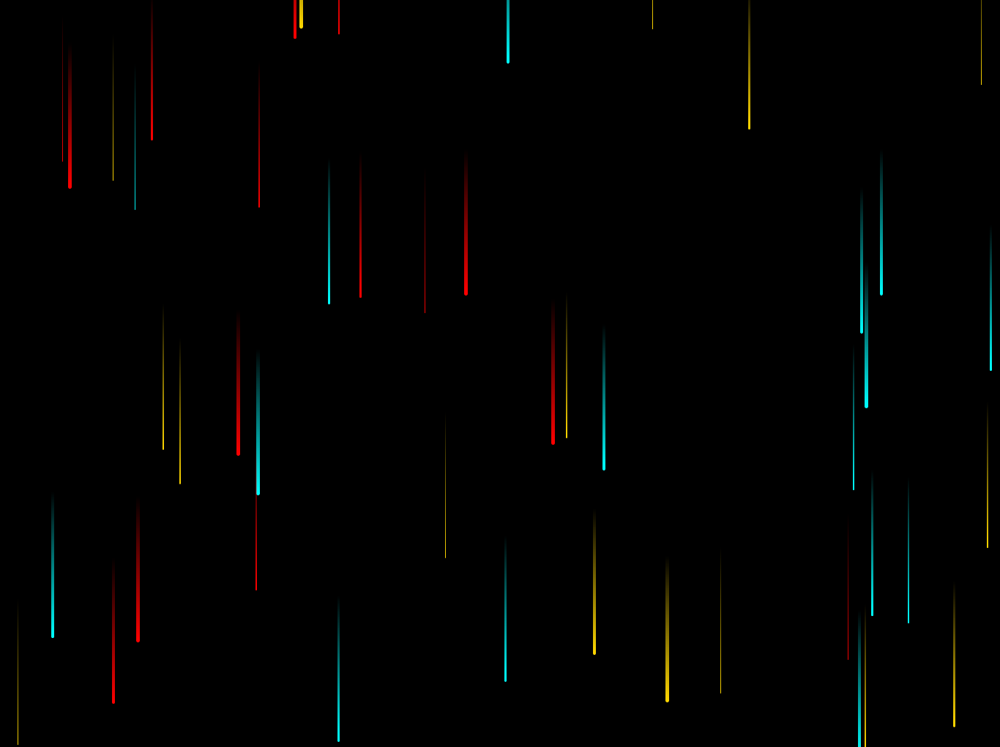

## RAINING PARTICAL

## Le challenge

Animation raining partical construite avec le HTML5, CSS3 et JavaScript

## Démonstration

Lien vers le projet : https://aperbet56.github.io/raining_partical/

## Projet développé avec

- Utilisation des balises sémantiques HTML5
- CSS3
- Utilisation d'un normaliseur : normalize.css
- Page web responsive
- Desktop first
- JavaScript
- Code JavaScript commenté
- Desktop first
